# ka-tugas-cloud

Praktikum infrastruktur cloud pada host Linux x86_64.

**Ini bukan satu sistem yang harus hidup barengan.** Ada **6 modul terpisah**. Tiap modul berdiri sendiri: jalankan, buktikan, matikan, baru lanjut modul berikutnya. Urutan di bawah hanya urutan belajar, bukan alur runtime.

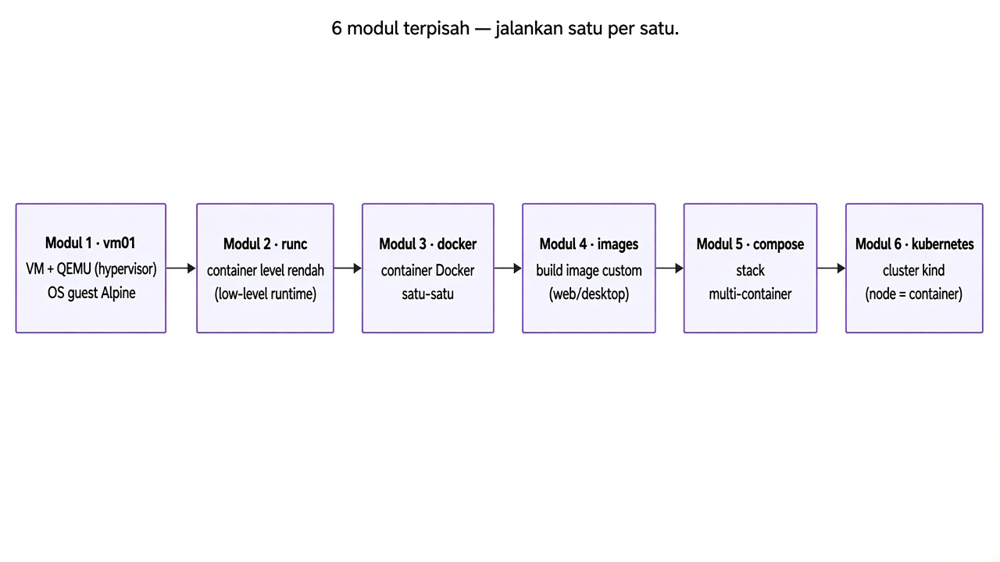

## Daftar modul

| Modul | Direktori | Topik |
|---|---|---|
| **1. VM** | `vm01/` | Dua VM Alpine di QEMU, bridge, volume, simulasi putus jaringan |
| **2. runc** | `containers/runc/` | Runtime container level rendah: `run`, `exec`, `kill`, `delete` |
| **3. Docker** | `containers/docker/` | Proses Alpine, web Python, MySQL + phpMyAdmin |
| **4. Image** | `containers/compose/images/` | Build dan jalankan image custom (Apache, noVNC, Nginx) |
| **5. Compose** | `containers/compose/compose/` | Stack multi-container (Nginx, TLS, WordPress, app+MySQL) |
| **6. Kubernetes** | `kubernetes/` | Cluster kind, ingress, Prometheus/Grafana, Octant, workload + research |

## Cara menjalankan

1. Pilih **satu modul**.
2. Ikuti tutorial modul itu sampai selesai.
3. **Matikan** semua yang dinyalakan di modul itu.
4. Baru buka modul berikutnya.

Jangan nyalain beberapa modul sekaligus. Port **80**, **443**, **9999**, dan **10000** dipakai ulang antar modul/case. VM TCG juga makan CPU; matikan guest sebelum masuk modul Kubernetes.

Di dalam modul Docker / Image / Compose / Kubernetes, **case juga satu per satu**: nyalakan → cek → hentikan → case berikutnya.

**Label di comment dalam blok perintah** (bukan teks di luar):

| Comment | Artinya |
|---|---|
| `# HOST` | Terminal biasa di WSL/Linux kamu — bukan di dalam VM |
| `# VM-1` | Konsol serial guest dari `./08-run-vm1-bridge.sh` |
| `# VM-2` | Konsol serial guest dari `./09-run-vm2-bridge.sh` |

Comment di dalam blok = **satu kelompok perintah** (bukan per baris). Ada 1 baris kosong sebelum tiap comment berikutnya.

```text
.
├── vm01/                 Modul 1 — mesin virtual
├── containers/
│   ├── runc/             Modul 2 — runc
│   ├── docker/           Modul 3 — Docker
│   └── compose/
│       ├── images/       Modul 4 — image custom
│       └── compose/      Modul 5 — Compose
└── kubernetes/           Modul 6 — Kubernetes
    ├── bin/              kind, kubectl, helm
    ├── setup-cluster/    kind cluster, ingress, Prometheus
    ├── apps/             Octant + case workload
    └── research/         app-sample + eksperimen Locust
```

---

## Prasyarat host (sekali saja)

**Maksud:** menyiapkan alat di laptop/WSL supaya semua modul bisa jalan.  
**Tujuan:** Docker, QEMU, runc, Packer, dan Compose tersedia sebelum mulai Modul 1–6.

Bukan modul praktikum. Semua perintah di bawah di host.

```bash
# HOST — pasang paket dasar + masukkan user ke grup docker
sudo apt-get update
sudo apt-get install -y \
  docker.io qemu-system-x86 qemu-utils iptables runc \
  openssh-client curl ca-certificates unzip
sudo usermod -aG docker "$USER"
```

Keluar lalu masuk lagi supaya grup `docker` dipakai. Cek:

```bash
# HOST — verifikasi Docker, QEMU, runc
docker version
qemu-system-x86_64 --version
runc --version
```

Packer (hanya untuk Modul 1):

```bash
# HOST — unduh Packer, pasang plugin QEMU, cek versi
mkdir -p "$HOME/.local/bin"
curl -fsSL -o /tmp/packer.zip \
  https://releases.hashicorp.com/packer/1.11.2/packer_1.11.2_linux_amd64.zip
unzip -o /tmp/packer.zip -d "$HOME/.local/bin"
chmod +x "$HOME/.local/bin/packer"
export PATH="$HOME/.local/bin:$PATH"
packer plugins install github.com/hashicorp/qemu
packer version
```

Kalau `/dev/kvm` tidak bisa dipakai (umum di WSL), Packer dan QEMU memakai TCG. Tambahkan `export PATH="$HOME/.local/bin:$PATH"` ke shell yang menjalankan Packer.

Plugin Compose (Modul 5), bila `docker compose` belum ada:

```bash
# HOST — pasang plugin docker compose v2
mkdir -p "$HOME/.docker/cli-plugins"
curl -fsSL -o "$HOME/.docker/cli-plugins/docker-compose" \
  https://github.com/docker/compose/releases/download/v2.36.2/docker-compose-linux-x86_64
chmod +x "$HOME/.docker/cli-plugins/docker-compose"
docker compose version
```

---

## Modul 1 — VM

**Tujuan modul:** memahami mesin virtual: image disk, guest OS, hypervisor QEMU, bridge/tap, volume, dan kegagalan jaringan.

**Login guest:** `root` / `packer`  
**Jaringan:** bridge `10.10.0.1/24`, VM-1 `10.10.0.11`, VM-2 `10.10.0.12`

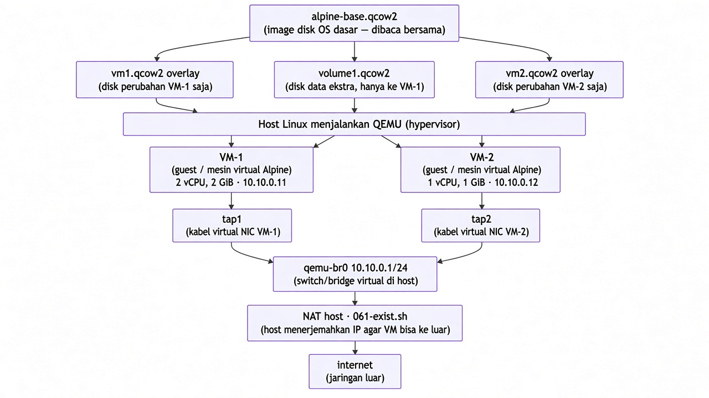

| Istilah di gambar | Artinya singkat |
|---|---|
| Image disk / overlay | File hard disk virtual (`.qcow2`) |
| Volume | Disk ekstra untuk data, hanya ke VM-1 |
| Guest / VM | OS Alpine yang “hidup” di dalam QEMU |
| QEMU (hypervisor) | Program di host yang menjalankan VM |
| tap | Kabel jaringan virtual dari NIC guest ke bridge |
| Bridge `qemu-br0` | Switch virtual di host |
| NAT | Host meneruskan traffic guest ke internet |

### 1.1 Build image dasar

**Maksud:** membuat hard disk virtual Alpine sekali pakai bersama.  
**Tujuan:** punya `alpine-base.qcow2` sebagai OS dasar; VM-1 dan VM-2 nanti hanya menyimpan perubahannya di overlay.

ISO dan checksum sudah tertulis di `vm01/packer/alpine-qemu.json`.

```bash
# HOST — unduh ISO Alpine + cek checksum
cd vm01
mkdir -p iso
curl -fL -o iso/alpine-standard-3.24.1-x86_64.iso \
  https://dl-cdn.alpinelinux.org/alpine/v3.24/releases/x86_64/alpine-standard-3.24.1-x86_64.iso
sha256sum iso/alpine-standard-3.24.1-x86_64.iso
```

Checksum yang diharapkan: `f4dd613206676c62949144c8ad75fc64582099f444dd1485bae104a60f51dd26`.

Build (lama). Tanpa KVM pakai TCG:

```bash
# HOST — build image dasar Packer, salin ke lokasi lab (default LAB_ROOT=$PWD/lab)
packer build -var accelerator=tcg packer/alpine-qemu.json
mkdir -p lab/images
cp output-alpine/alpine-base.qcow2 lab/images/alpine-base.qcow2
```

Kalau KVM tersedia: `-var accelerator=kvm`.

Cek boot image tanpa bridge (opsional, skrip cepat dosen):

```bash
# HOST — boot langsung image dasar (butuh lab/images/alpine-base.qcow2)
cd vm01
./run-simple.sh
```


### 1.2 Siapkan disk dan jaringan

**Maksud:** menyiapkan overlay, volume, bridge, dan NAT di host sebelum guest dinyalakan.  
**Tujuan:** infrastruktur host siap; VM belum boot.

```bash
# HOST — buat overlay/volume + aktifkan bridge/NAT
cd vm01
./run-all-preparation.sh
sudo ./061-enable-vm-outside.sh
```

Skrip membuat overlay `vm1`/`vm2`, volume data, bridge `qemu-br0`, `tap1`, dan `tap2`.

Docker memasang policy `FORWARD` ke `DROP`. Tanpa aturan ini, guest bisa ping gateway tetapi tidak bisa ping satu sama lain:

```bash
# HOST — izinkan forwarding antar guest di bridge
sudo iptables -I FORWARD -i qemu-br0 -o qemu-br0 -j ACCEPT
```

Tanpa `/dev/kvm`:

```bash
# HOST — paksa QEMU pakai TCG (lebih lambat)
export FORCE_TCG=1
```

### 1.3 Nyalakan guest + IP + volume

**Maksud:** boot dua guest, kasih IP statis, format volume di VM-1.  
**Tujuan:** VM-1 = `10.10.0.11` + disk `/data`; VM-2 = `10.10.0.12`; keduanya bisa reach gateway.

```bash
# HOST — terminal 1: boot VM-1 (jendela ini jadi konsol VM-1)
cd vm01
./08-run-vm1-bridge.sh
```

```bash
# HOST — terminal 2: boot VM-2 (jendela ini jadi konsol VM-2)
cd vm01
./09-run-vm2-bridge.sh
```

Login di kedua konsol: `root` / `packer`.

```bash
# HOST — terminal 3: HTTP server supaya guest unduh skrip
cd vm01
python3 -m http.server 8765 --bind 10.10.0.1
```

```sh
# VM-1 — naikkan NIC + IP/route sementara
ip link set eth0 up
ip addr add 10.10.0.11/24 dev eth0
ip route add default via 10.10.0.1

# VM-1 — unduh skrip guest dari host
cd /root
curl -fsSL -O http://10.10.0.1:8765/guest-configure-ip.sh
curl -fsSL -O http://10.10.0.1:8765/guest-prepare-volume.sh
curl -fsSL -O http://10.10.0.1:8765/guest-mount-volume.sh

# VM-1 — persist IP + format/mount volume /data
bash ./guest-configure-ip.sh eth0 10.10.0.11/24 10.10.0.1 1.1.1.1
bash ./guest-prepare-volume.sh /dev/vdb /data
```

Ketik `FORMAT` saat diminta. Cek `/data/test.txt`.  
`/dev/vdb` hanya ada di **VM-1**. Jangan jalankan di host atau di VM-2.

```sh
# VM-2 — naikkan NIC + IP/route sementara
ip link set eth0 up
ip addr add 10.10.0.12/24 dev eth0
ip route add default via 10.10.0.1

# VM-2 — unduh skrip + persist IP
cd /root
curl -fsSL -O http://10.10.0.1:8765/guest-configure-ip.sh
bash ./guest-configure-ip.sh eth0 10.10.0.12/24 10.10.0.1 1.1.1.1
```

```bash
# HOST — hentikan HTTP server setelah skrip tersalin (Ctrl+C di terminal 3)
```

Boot berikutnya memakai `/etc/network/interfaces`. Volume tidak masuk fstab.

```sh
# VM-1 — remount volume setelah reboot + cek isi
bash ./guest-mount-volume.sh /dev/vdb /data
cat /data/test.txt
```

### 1.4 Ping, putus `tap2`, pulihkan

**Maksud:** membuktikan VM-1 ↔ VM-2, lalu mensimulasikan kabel VM-2 putus dari host.  
**Tujuan:** lihat ping gagal saat `tap2` down, lalu pulih setelah `tap2` up.

```sh
# VM-1 — uji ping ke VM-2
ping -c 3 10.10.0.12
```

Biarkan ping panjang berjalan (`ping 10.10.0.12`).

```bash
# HOST — putus kabel virtual VM-2 (tap2 down) saat ping masih jalan
cd vm01
sudo ./12-fail-vm2-network.sh
```

Ping di VM-1 putus.

```bash
# HOST — pulihkan tap2
sudo ./13-restore-vm2-network.sh
```

Ping kembali.

### 1.5 Selesai Modul 1 — matikan

**Maksud:** menutup modul VM supaya CPU/port tidak mengganggu modul lain.  
**Tujuan:** kedua guest mati; opsional bersihkan bridge/overlay.

```sh
# VM-1 dan VM-2 — matikan guest
poweroff
```

```bash
# HOST — opsional: bersihkan bridge/tap + reset overlay/volume (image dasar aman)
cd vm01
sudo ./15-cleanup-network.sh
./18-reset-generated-storage.sh
```

**Sebelum Modul 6 (Kubernetes):** pastikan kedua VM sudah `poweroff`. TCG makan CPU cluster.

---

## Modul 2 — runc

**Tujuan modul:** menjalankan container tanpa Docker daemon, lewat runtime OCI `runc`.

Semua perintah di host (butuh root). Modul ini tidak memakai port host.

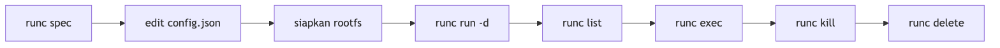

### 2.1 Rootfs dan spec

**Maksud:** menyiapkan filesystem container dan file konfigurasi OCI.  
**Tujuan:** punya folder `rootfs/` + `config.json` siap dijalankan `runc`.

```bash
# HOST — ekspor rootfs Alpine lewat Docker
mkdir -p /tmp/runc-lab/rootfs
cd /tmp/runc-lab
cid=$(docker run -d alpine:3.18)
docker export "$cid" | sudo tar -C rootfs -xv
docker rm -f "$cid"

# HOST — buat config.json OCI (hapus dulu kalau sisa percobaan sebelumnya)
sudo rm -f config.json
sudo runc spec
```

Sesuaikan `config.json` (proses tidur di background, user root, terminal mati, rootfs bisa ditulis):

```bash
# HOST — ubah config.json: proses background, root, rootfs writable
sudo python3 - << 'PY'
import json
with open("config.json") as f:
    cfg = json.load(f)
cfg["process"]["terminal"] = False
cfg["process"]["user"] = {"uid": 0, "gid": 0}
cfg["process"]["args"] = ["sh", "-c", "while true; do sleep 1000; done"]
cfg["root"]["readonly"] = False
with open("config.json", "w") as f:
    json.dump(cfg, f, indent=2)
PY
```

### 2.2 Jalankan dan uji

**Maksud:** menjalankan container lalu masuk ke dalamnya.  
**Tujuan:** membuktikan `run`, `list`, dan `exec` (termasuk user non-root).

```bash
# HOST — jalankan container + uji exec (root dan non-root)
sudo runc run -d lab1
sudo runc list
sudo runc exec lab1 echo hello
sudo runc exec --user 1000:1000 lab1 echo hello-user
```

### 2.3 Selesai Modul 2 — matikan

**Maksud:** menghentikan dan menghapus container runc.  
**Tujuan:** tidak ada container `lab1` tersisa.

```bash
# HOST — matikan dulu, baru hapus (urutan OCI: kill → delete)
sudo runc kill lab1 KILL
sudo runc delete lab1
```

---

## Modul 3 — Docker

**Tujuan modul:** menjalankan container lewat Docker Engine, satu case per sekali.

**Aturan:** satu case → cek → matikan/hapus → case berikutnya. Port **9999** dan **10000** bentrok dengan Modul 4 dan 5.

Semua perintah di host.

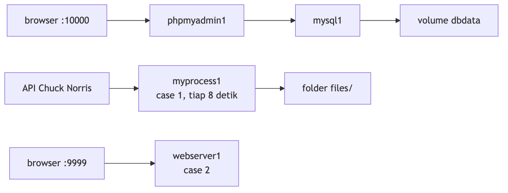

### Case 1 — proses Alpine

**Maksud:** container yang jalan di background, menulis file ke folder host.  
**Tujuan:** melihat proses + volume mount tanpa membuka port web.

```bash
# HOST — jalankan proses Alpine + cek isi volume
cd containers/docker/case1
sh run_process.sh
docker exec myprocess1 ls /data

# pilihan: matikan saja (container masih ada, bisa docker start lagi)
docker stop myprocess1

# atau hapus container
docker rm -f myprocess1
```

Container `myprocess1` menulis joke ke `files/` tiap 8 detik.

### Case 2 — web server Python (port 9999)

**Maksud:** container yang melayani HTTP di port host.  
**Tujuan:** akses halaman dari browser/`curl` di host.

```bash
# HOST — jalankan web server + cek HTTP
cd containers/docker/case2
sh run_simple_web.sh
curl -s -o /dev/null -w '%{http_code}\n' http://127.0.0.1:9999/
curl -s http://127.0.0.1:9999/

# pilihan: matikan saja
docker stop webserver1

# atau hapus container
docker rm -f webserver1
```

### Case 3 — MySQL dan phpMyAdmin (port 10000)

**Maksud:** dua container saling terhubung: UI web + database.  
**Tujuan:** phpMyAdmin di `:10000` bisa bicara ke MySQL lewat `--link`.

```bash
# HOST — jalankan MySQL + phpMyAdmin, cek UI
cd containers/docker/case3
sh run_mysql.sh
sh run_myadmin.sh
curl -s -o /dev/null -w '%{http_code}\n' http://127.0.0.1:10000/

# pilihan: matikan saja
docker stop phpmyadmin1 mysql1

# atau hapus container
docker rm -f phpmyadmin1 mysql1
```

MySQL harus sudah jalan sebelum phpMyAdmin. Login di `http://127.0.0.1:10000/`:

| Field | Nilai |
|---|---|
| Server | `mysql1` (sudah diisi lewat `PMA_HOST`) |
| Username | `root` |
| Password | `mydb6789tyui` |
| Database | `mydb` |

### Selesai Modul 3

**Maksud:** pastikan tidak ada container modul ini yang masih memegang port.  
**Tujuan:** host bersih sebelum Modul 4/5.

```bash
# HOST — bersihkan sisa container modul ini (abaikan yang sudah tidak ada)
docker rm -f myprocess1 webserver1 phpmyadmin1 mysql1 2>/dev/null || true
```

---

## Modul 4 — Image custom

**Tujuan modul:** membangun image sendiri (`docker build`), lalu menjalankannya sebagai container.

**Aturan:** satu case → cek → matikan/hapus → case berikutnya. Port **9999** bentrok dengan Modul 3 dan 5.

Semua perintah di host.

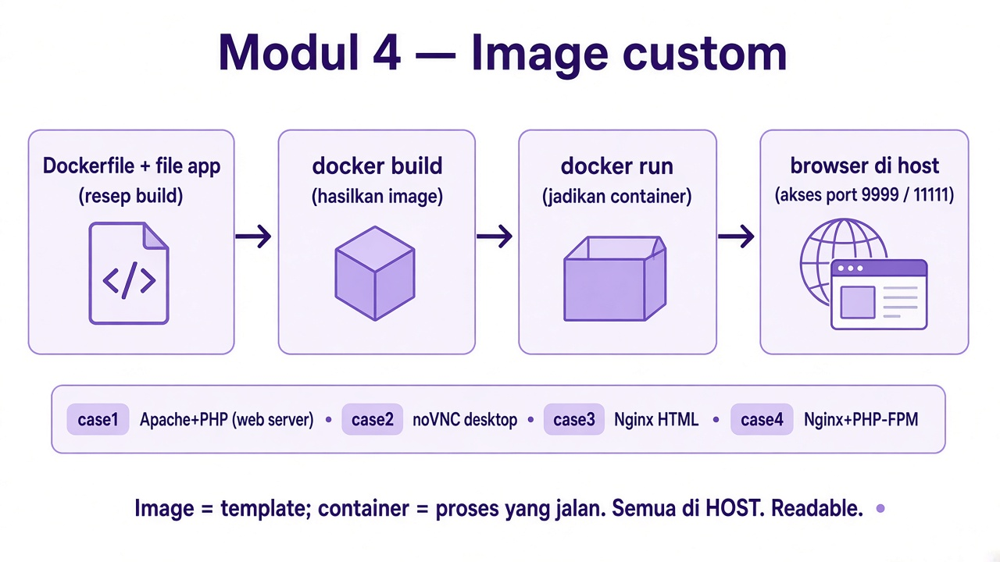

### Case 1 — Apache/PHP `mywebserver:1.0` (port 9999)

**Maksud:** build image web Apache/PHP, jalankan dengan HTML dari folder host.  
**Tujuan:** `http://127.0.0.1:9999/` menyajikan konten dari `runcontainer/html`.

Dockerfile di `platform/`. Skrip run memasang `html/` dari `runcontainer/`.

```bash
# HOST — build image, jalankan container, cek HTTP
cd containers/compose/images/case1/platform
sh build.sh
cd ../runcontainer
sh run-mywebserver.sh
curl -s -o /dev/null -w '%{http_code}\n' http://127.0.0.1:9999/

# pilihan: matikan saja
docker stop mywebserver

# atau hapus container
docker rm -f mywebserver
```

### Case 2 — desktop noVNC `mylinux:1.0`

**Maksud:** image desktop Linux yang diakses lewat browser (noVNC).  
**Tujuan:** buka UI desktop di port **11111** (VNC mentah di **12111**). Akun desktop: `user1`.

```bash
# HOST — build image, jalankan noVNC, cek UI
cd containers/compose/images/case2/platform
sh build.sh
cd ../runcontainer
sh run-mylinux.sh
curl -s -o /dev/null -w '%{http_code}\n' http://127.0.0.1:11111/

# pilihan: matikan saja
docker stop mylinux

# atau hapus container
docker rm -f mylinux
```


### Case 3 — Nginx statis `mywebserver:2.0` (port 9999)

**Maksud:** image Nginx yang menyajikan HTML statis.  
**Tujuan:** web server ringan di `:9999`.

```bash
# HOST — build image, jalankan Nginx, cek HTTP
cd containers/compose/images/case3
sh build.sh
sh run-server.sh
curl -s -o /dev/null -w '%{http_code}\n' http://127.0.0.1:9999/

# pilihan: matikan saja
docker stop webserver2

# atau hapus container
docker rm -f webserver2
```

### Case 4 — Nginx dan PHP-FPM `mywebserver:2.1` (port 9999)

**Maksud:** image Nginx + PHP-FPM (bukan hanya HTML).  
**Tujuan:** `test.php` dieksekusi PHP di dalam container.

```bash
# HOST — build image, jalankan Nginx+PHP, cek test.php
cd containers/compose/images/case4
sh build.sh
sh run-server.sh
curl -s -o /dev/null -w '%{http_code}\n' http://127.0.0.1:9999/test.php

# pilihan: matikan saja
docker stop webserver2

# atau hapus container
docker rm -f webserver2
```

### Selesai Modul 4

**Maksud:** hapus container image custom yang masih jalan.  
**Tujuan:** port **9999** / **11111** kosong.

```bash
# HOST — bersihkan sisa container modul ini
docker rm -f mywebserver mylinux webserver2 2>/dev/null || true
```

---

## Modul 5 — Compose

**Tujuan modul:** menjalankan beberapa container sebagai satu stack dengan `docker compose`.

**Aturan:** satu case → cek → matikan/hapus stack → case berikutnya.  
`docker compose stop` hanya mematikan; `docker compose down` mematikan **dan** menghapus container + network. Keduanya **tidak** menghapus volume `dbdata/` dan `wp_vol/` (kecuali `down -v`).

Port yang bentrok: **9999**, **10000**, **80**, **443** (dengan Modul 3, 4, dan 6).

Semua perintah di host.

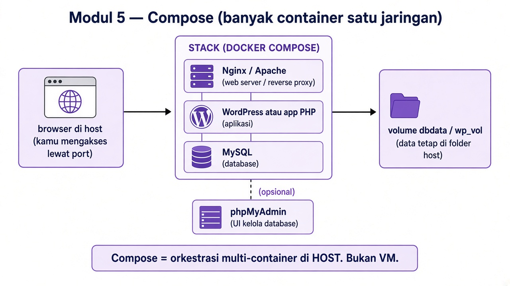

### Example — MySQL 8 dan phpMyAdmin (port 10000)

**Maksud:** stack paling sederhana: database + UI admin.  
**Tujuan:** phpMyAdmin menjawab di `:10000`.

```bash
# HOST — naikkan stack + cek phpMyAdmin
cd containers/compose/compose/example
docker compose up -d
curl -s -o /dev/null -w '%{http_code}\n' http://127.0.0.1:10000/

# pilihan: matikan saja (container masih ada, bisa docker compose start)
docker compose stop

# atau hapus container + network (volume tetap)
docker compose down
```

### Case 1 — Nginx statis (port 9999)

**Maksud:** satu service web lewat Compose.  
**Tujuan:** HTML di `:9999` tanpa `docker run` manual.

```bash
# HOST — naikkan stack + cek HTTP
cd containers/compose/compose/case1
docker compose up -d
curl -s -o /dev/null -w '%{http_code}\n' http://127.0.0.1:9999/

# pilihan: matikan saja
docker compose stop

# atau hapus container + network
docker compose down
```

### Case 2 — Nginx TLS (port 80 dan 443)

**Maksud:** web server dengan sertifikat HTTPS.  
**Tujuan:** HTTPS 200 di `:443`; HTTP biasanya redirect.

```bash
# HOST — naikkan stack TLS + cek HTTPS/HTTP
cd containers/compose/compose/case2
docker compose up -d
curl -sk -o /dev/null -w '%{http_code}\n' https://127.0.0.1/
curl -s -o /dev/null -w '%{http_code}\n' http://127.0.0.1/

# pilihan: matikan saja
docker compose stop

# atau hapus container + network
docker compose down
```

### Case 3 — WordPress, Nginx TLS, phpMyAdmin

**Maksud:** stack aplikasi nyata: reverse proxy TLS + WordPress + MySQL + phpMyAdmin.  
**Tujuan:** situs lewat hostname di `.env`; phpMyAdmin di port `30081`.

`.env` memakai `pm99.rm-dev.my.id`. Cek lewat `--resolve`, tanpa mengubah `/etc/hosts`.

```bash
# HOST — naikkan stack WordPress + cek situs dan phpMyAdmin
cd containers/compose/compose/case3
docker compose up -d
curl -sk --resolve pm99.rm-dev.my.id:443:127.0.0.1 \
  -o /dev/null -w '%{http_code}\n' https://pm99.rm-dev.my.id/
curl -s -o /dev/null -w '%{http_code}\n' http://127.0.0.1:30081/

# pilihan: matikan saja
docker compose stop

# atau hapus container + network (wp_vol tetap)
docker compose down
```

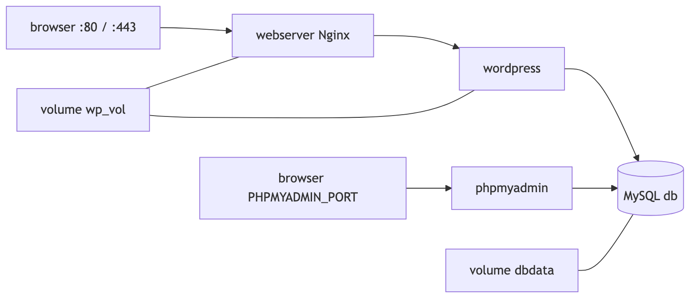

### Case 4 — aplikasi PHP, MySQL 5.7, phpMyAdmin

**Maksud:** Compose yang ikut `build` image aplikasi.  
**Tujuan:** app di **34001**, phpMyAdmin di **10000**.

```bash
# HOST — build+naikkan stack + cek app dan phpMyAdmin
cd containers/compose/compose/case4
docker compose up -d --build
curl -s -o /dev/null -w '%{http_code}\n' http://127.0.0.1:34001/
curl -s -o /dev/null -w '%{http_code}\n' http://127.0.0.1:10000/

# pilihan: matikan saja
docker compose stop

# atau hapus container + network (dbdata tetap)
docker compose down
```

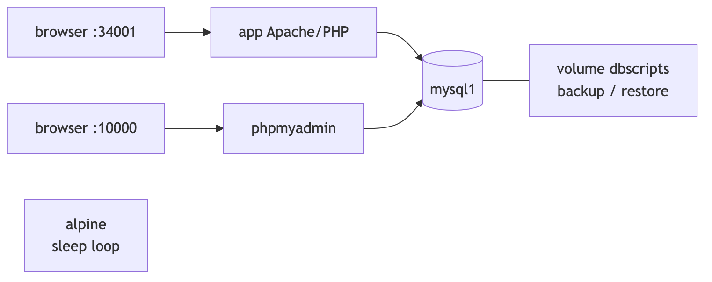

### Selesai Modul 5

**Maksud:** semua stack Compose sudah dimatikan/dihapus.  
**Tujuan:** port **80** dan **443** kosong sebelum Modul 6.

```bash
# HOST — di tiap folder case, pilih salah satu:
#   docker compose stop   → matikan saja
#   docker compose down   → hapus container + network
```

---

## Modul 6 — Kubernetes

**Tujuan modul:** cluster lokal dengan kind, ingress-nginx, Prometheus/Grafana (Helm), dashboard Octant, workload contoh, dan folder research (app-sample + eksperimen Locust).

**Syarat:** Modul 1 (VM) sudah dimatikan. Port **80** dan **443** kosong (Modul 5 sudah `down`).

Cluster `mylab99`: **1 control-plane + 3 worker**. API host **16443**. Ingress **80**, **443**, **30080**, **30443**.

`download.sh` mengambil:
- kind **v0.33.0**
- kubectl **v1.28.13**
- Helm **v4.3.0**

Cluster di-pin ke **Kubernetes 1.28.13** di `cluster-config.yaml` karena manifest ingress-nginx **v1.9.4** butuh Kubernetes **1.25–1.28** (default node kind v0.33 = 1.37).

Host IP lab untuk Ingress research/Prometheus (sslip.io) default **`10.28.84.254`**. Override: `HOST_IP=<ip-kamu>`.

Semua perintah di host.

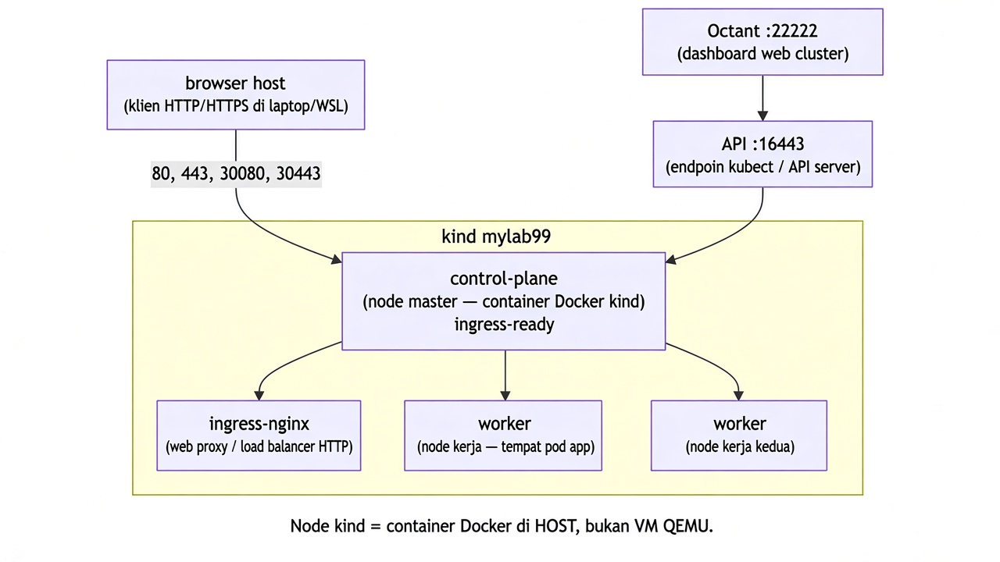

| Istilah | Artinya singkat |
|---|---|
| kind node | Container Docker yang berperan sebagai “node” Kubernetes |
| control-plane | Node master (API server, scheduler, dll.) |
| worker | Node tempat pod aplikasi jalan |
| ingress-nginx | Proxy HTTP/HTTPS masuk ke service (+ metrics) |
| Helm | Package manager chart (Prometheus stack) |
| Prometheus / Grafana | Metrik cluster + dashboard |
| Octant | Dashboard web untuk melihat cluster |

### 6.1 Alat, cluster, ingress

**Maksud:** unduh `kind` / `kubectl` / `helm`, buat cluster, pasang ingress controller.  
**Tujuan:** empat node Ready (1 CP + 3 worker) dan ingress siap di 80/443.

```bash
# HOST — unduh kind/kubectl/helm + set PATH
cd kubernetes/bin
sh download.sh
source set.sh

# HOST — buat cluster kind + pasang/cek ingress
cd ../setup-cluster/kind
sh 1-create-cluster.sh
sh 2-set-config.sh
export KUBECONFIG="$PWD/kubeconfig"
sh 3-install-ingress.sh
sh 4-cek-ingress.sh
kubectl get nodes
```

`1-create-cluster.sh` menaikkan `fs.inotify.max_user_*` (butuh `sudo`) supaya banyak pod/file-watch tidak gagal.

`export` di dalam `sh 2-set-config.sh` tidak masuk ke shell pemanggil. Terminal lain perlu:

```bash
# HOST — set ulang env di terminal baru
export KUBECONFIG=/path/ke/kubernetes/setup-cluster/kind/kubeconfig
export PATH="/path/ke/kubernetes/bin:$PATH"
```

`4-cek-ingress.sh` menunggu controller paling lama 90 detik. Ulangi bila pod belum Ready.

### 6.2 Prometheus + Grafana (Helm)

**Maksud:** pasang `kube-prometheus-stack` lewat Helm + Ingress sslip.io + ServiceMonitor untuk ingress-nginx.  
**Tujuan:** `http://prometheus.<HOST_IP>.sslip.io` dan Grafana reachable.

```bash
# HOST — pastikan PATH punya helm + KUBECONFIG sudah di-set
cd kubernetes/setup-cluster/kind
# ganti IP bila bukan di lab kampus:
#   HOST_IP=$(hostname -I | awk '{print $1}')
HOST_IP="${HOST_IP:-10.28.84.254}" sh 5-install-prometheus.sh
```

Cek:

```bash
# HOST — kesehatan Prometheus + password Grafana
curl -s "http://prometheus.${HOST_IP:-10.28.84.254}.sslip.io/-/healthy"
kubectl get secret monitoring-grafana -n monitoring \
  -o jsonpath='{.data.admin-password}' | base64 -d; echo
```

DNS sslip.io butuh host bisa resolve `*.<IP>.sslip.io` ke IP itu (biasanya otomatis di internet).

### 6.3 Octant

**Maksud:** menjalankan UI visualisasi cluster.  
**Tujuan:** buka `http://127.0.0.1:22222` dan melihat resource.

```bash
# HOST — unduh + jalankan Octant, cek dashboard
cd kubernetes/apps/1_visualizer
sh download.sh
export KUBECONFIG=/path/ke/kubernetes/setup-cluster/kind/kubeconfig
sh run.sh
curl -s -o /dev/null -w '%{http_code}\n' http://127.0.0.1:22222/
```

PID proses ada di `octant.pid`.

### Case 1 — ingress HTTP

**Maksud:** beberapa service di belakang satu ingress HTTP.  
**Tujuan:** path `/foo`, `/bar4`, `/counter`, `/coba` menjawab 200.

```bash
# HOST — deploy workload case 1
cd kubernetes/apps/2_case1
sh run.sh
kubectl get pods

# HOST — cek HTTP tiap path ingress
curl -s -o /dev/null -w 'foo %{http_code}\n' http://127.0.0.1/foo/
curl -s -o /dev/null -w 'bar4 %{http_code}\n' http://127.0.0.1/bar4/
curl -s -o /dev/null -w 'counter %{http_code}\n' http://127.0.0.1/counter/
curl -s -o /dev/null -w 'coba %{http_code}\n' http://127.0.0.1/coba/
```

| Path | Service |
|---|---|
| `/foo` | `foo-service:8080` (`agnhost`) |
| `/bar4` | `bar-service:8080` |
| `/counter` | `counter-service:8888` |
| `/coba` | `coba-service:80` |

Opsional (Deployment/StatefulSet nginx, **tidak** ikut `run.sh`):

```bash
# HOST — apply terpisah bila perlu path /web1 dan /web2
kubectl apply -f web1.yaml -f web2.yaml
curl -s -o /dev/null -w 'web1 %{http_code}\n' http://127.0.0.1/web1/
curl -s -o /dev/null -w 'web2 %{http_code}\n' http://127.0.0.1/web2/
```

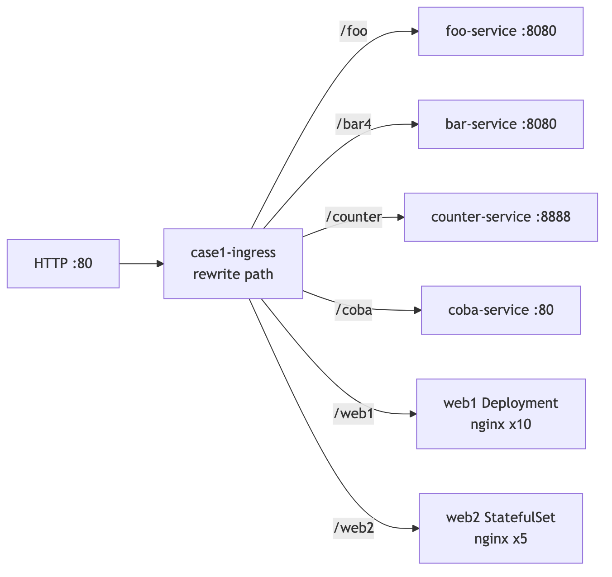

Ingress case 1 dan case 2 sama-sama bernama `case1-ingress`. Hapus case 1 sebelum case 2:

```bash
# HOST — hapus resource case 1 sebelum case 2
kubectl delete \
  -f foo.yaml -f bar.yaml -f coba.yaml -f counter.yaml \
  -f ingress.yaml
# plus web1.yaml web2.yaml bila sempat di-apply
```

### Case 2 — ingress HTTPS + image privat

**Maksud:** Ingress TLS + percobaan pull image privat.  
**Tujuan:** `/foo`, `/bar`, `/coba` HTTPS 200; lihat status `coba2` (bisa ImagePullBackOff bila secret registry salah).

```bash
# HOST — deploy case 2 + cek HTTPS + status pod privat
cd kubernetes/apps/3_case2
sh run.sh
curl -sk -o /dev/null -w 'foo %{http_code}\n' https://127.0.0.1/foo/
curl -sk -o /dev/null -w 'bar %{http_code}\n' https://127.0.0.1/bar/
curl -sk -o /dev/null -w 'coba %{http_code}\n' https://127.0.0.1/coba/
curl -sk -o /dev/null -w 'coba2 %{http_code}\n' https://127.0.0.1/coba2/
kubectl get pod coba2-app
```

Jangan memublikasikan `docker-secret.yaml`.

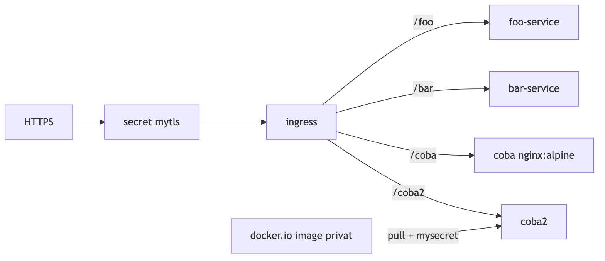

### Case 3 — log pod

**Maksud:** pod sederhana yang menulis ke stdout.  
**Tujuan:** membaca log dengan `kubectl logs`.

```bash
# HOST — deploy counter + baca log
cd kubernetes/apps/4_case3
sh run.sh
kubectl logs counter --tail=5
```

### Research — app-sample + eksperimen

**Maksud:** aplikasi Flask/Gunicorn + load Locust + export metrik Prometheus (folder dari update dosen).  
**Tujuan:** endpoint `/`, `/cpu`, `/sleep`, `/health` terukur; dataset `data/processed/<run_id>.csv`.

Prasyarat: cluster + ingress + Prometheus (6.1–6.2) sudah jalan. Sesuaikan host Ingress bila IP beda (edit `k8s/deployment.yaml` / set `APP_HOST`/`PROM_HOST`/`HOST_IP`).

```bash
# HOST — build image, load ke kind mylab99, deploy
cd kubernetes/research/app-sample
./scripts/install-all.sh
# atau langkah terpisah:
#   ./scripts/build-load.sh
#   ./scripts/deploy.sh
#   ./scripts/verify.sh

# HOST — eksperimen Locust (venv + dependencies dulu)
cd ../experiments
python3 -m venv venv
. venv/bin/activate
pip install -r requirements.txt
./scripts/run-experiment.sh run01 10
```

Detail lengkap: `kubernetes/research/app-sample/README.md` dan `kubernetes/research/experiments/README.md`.

Default cluster name di script: **`mylab99`** (`KIND_CLUSTER`).

### Selesai Modul 6 — matikan

**Maksud:** menghapus cluster kind dan menghentikan Octant.  
**Tujuan:** host kembali bersih.

```bash
# HOST — hapus cluster kind + hentikan Octant
kind delete cluster --name mylab99
kill "$(cat kubernetes/apps/1_visualizer/octant.pid)" 2>/dev/null || true
```
