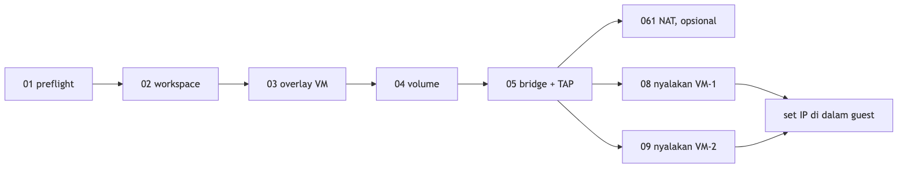
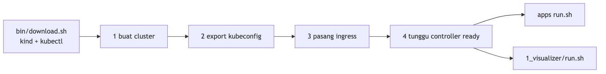

# ka-tugas-cloud

Praktikum infrastruktur cloud pada host Linux x86_64: mesin virtual QEMU/KVM, runtime container, Docker, Compose, dan cluster Kubernetes lokal.


## Struktur

```text
.
├── vm01/                 mesin virtual Alpine di QEMU/KVM
├── containers/
│   ├── runc/             runtime container level rendah
│   ├── docker/           container Docker satu per satu
│   └── compose/          image custom dan stack Compose
└── kubernetes/           cluster kind dan workload
```

| Direktori | Isi |
|---|---|
| `vm01/` | Dua VM Alpine di atas satu image dasar, overlay disk, volume persisten, bridge `qemu-br0`, NAT, dan simulasi putus jaringan |
| `containers/runc/` | `runc spec`, rootfs, `runc run`, `exec`, `kill`, `delete` |
| `containers/docker/` | Proses Alpine, web server Python, MySQL, dan phpMyAdmin |
| `containers/compose/images/` | Image Apache/PHP, desktop noVNC, Nginx, serta Nginx dengan PHP-FPM |
| `containers/compose/compose/` | Stack Nginx, TLS, WordPress, dan aplikasi PHP yang terhubung ke MySQL |
| `kubernetes/` | Cluster kind (1 control-plane, 2 worker), ingress NGINX, Octant, dan workload contoh |

## Dokumentasi

| Berkas | Isi |
|---|---|
| [`vm01/README.md`](vm01/README.md) | Model lab, urutan skrip, jaringan guest, volume, kegagalan jaringan, pembersihan |
| [`vm01/packer/README.md`](vm01/packer/README.md) | Build `alpine-base.qcow2` dengan Packer |
| [`vm01/00-config.sh`](vm01/00-config.sh) | Path lab, ukuran vCPU dan RAM, nama bridge, alamat IP |
| [`containers/runc/README.MD`](containers/runc/README.MD) | Perintah `runc` |
| [`kubernetes/README.txt`](kubernetes/README.txt) | Unduh alat, buat cluster, jalankan Octant |

## Persyaratan

Seluruh skrip menargetkan Linux x86_64. Binary `kind`, `kubectl`, dan Octant yang diunduh skrip juga build Linux amd64.

**Mesin virtual**

- `qemu-system-x86_64` dan `qemu-img`
- `/dev/kvm`, atau `FORCE_TCG=1` untuk TCG (lebih lambat)
- `iproute2` dan utilitas bridge; sudo untuk bridge, TAP, dan NAT
- Packer dan ISO Alpine Standard x86_64, bila image dasar belum ada

**Container**

- Docker Engine
- `runc`
- `curl` dan `jq` diinstal di dalam container case proses, bukan di host

**Kubernetes**

- Docker, karena node kind berjalan sebagai container
- `curl`, untuk mengunduh `kind` dan `kubectl`
- Port host `80`, `443`, `30080`, `30443`, dan `16443` kosong

## Mesin virtual

Dokumentasi lengkap: [`vm01/README.md`](vm01/README.md).

Dua guest memakai overlay di atas satu image dasar. Disk data hanya menempel pada VM-1. Kedua guest masuk bridge yang sama lewat TAP.


`12-fail-vm2-network.sh` menonaktifkan `tap2`, sehingga VM-1 tidak mencapai `10.10.0.12`. `13-restore-vm2-network.sh` mengembalikan `tap2`. Skrip pembersihan tidak menghapus image dasar.

### Image dasar

Lokasi yang dipakai skrip:

```text
~/minicloud-lab/images/alpine-base.qcow2
```


Prosedur build ada di [`vm01/packer/README.md`](vm01/packer/README.md). Letakkan ISO di `vm01/iso/alpine-standard-x86_64.iso`, salin `packer/alpine-qemu-vars.example.json` menjadi `packer/alpine-qemu-vars.json`, isi checksum SHA-256 resmi, lalu:

```bash
cd vm01
packer validate -var-file=packer/alpine-qemu-vars.json packer/alpine-qemu.json
packer build -var-file=packer/alpine-qemu-vars.json packer/alpine-qemu.json
cp output-alpine/alpine-base.qcow2 ~/minicloud-lab/images/alpine-base.qcow2
```

### Persiapan host



```bash
cd vm01
./run-all-preparation.sh
```

Skrip menjalankan preflight, workspace, overlay `vm1`/`vm2`, volume data, lalu bridge `qemu-br0` dengan `tap1` dan `tap2`. VM tidak dinyalakan dan filesystem guest tidak diformat.

NAT ke luar host:

```bash
./061-enable-vm-outside.sh
```

Jalankan tiap guest di terminal terpisah:

```bash
./08-run-vm1-bridge.sh
./09-run-vm2-bridge.sh
```

Di dalam guest, konfigurasi IP statis ditulis ke `/etc/network/interfaces`:

```bash
sudo ./guest-configure-ip.sh eth0 10.10.0.11/24 10.10.0.1 1.1.1.1   # VM-1
sudo ./guest-configure-ip.sh eth0 10.10.0.12/24 10.10.0.1 1.1.1.1   # VM-2
```

Volume persisten, dari dalam VM-1:

```bash
sudo ./guest-prepare-volume.sh /dev/vdb /data
```

### Pembersihan

```bash
./15-cleanup-network.sh
./18-reset-generated-storage.sh
```

Perintah pertama menghapus bridge dan TAP. Perintah kedua menghapus overlay dan volume hasil generate. Image dasar tetap ada.

## Container

### runc

Perintah ada di [`containers/runc/README.MD`](containers/runc/README.MD).


Rootfs dapat diekstrak dari image Docker, misalnya Alpine. `runc` menjalankan container tanpa daemon Docker.

### Docker

Jalankan skrip dari direktori case.

| Case | Perintah | Hasil |
|---|---|---|
| `containers/docker/case1` | `sh run_process.sh` | Container `myprocess1` (Alpine) menulis joke ke `files/` tiap `DELAY=8` detik |
| `containers/docker/case2` | `sh run_simple_web.sh` | Python HTTP server `webserver1` pada port host **9999** |
| `containers/docker/case3` | `sh run_mysql.sh`, lalu `sh run_myadmin.sh` | MySQL `mysql1` dan phpMyAdmin pada port host **10000** |

Kredensial MySQL case 3 ada di skrip (`MYSQL_ROOT_PASSWORD`). phpMyAdmin memakai `--link mysql1`, sehingga container MySQL harus sudah berjalan.


### Image

| Case | Build | Run | Image dan port |
|---|---|---|---|
| `containers/compose/images/case1` | `sh platform/build.sh` | `sh runcontainer/run-mywebserver.sh` | `mywebserver:1.0`, Apache/PHP, host **9999** |
| `containers/compose/images/case2` | `sh platform/build.sh` | `sh runcontainer/run-mylinux.sh` | `mylinux:1.0`, desktop Firefox lewat noVNC. VNC **12111**, web **11111** |
| `containers/compose/images/case3` | `sh build.sh` | `sh run-server.sh` | `mywebserver:2.0`, Nginx dan HTML statis, host **9999** |
| `containers/compose/images/case4` | `sh build.sh` | `sh run-server.sh` | `mywebserver:2.1`, Nginx dan PHP-FPM, host **9999** |

Build case 2 mengkloning noVNC dan membutuhkan jaringan. Akun desktop pada image: `user1`.


### Compose

Dari direktori case:

```bash
docker compose up -d
```

Berkas Compose memakai `version: '3'`.

| Case | Stack | Port host |
|---|---|---|
| `containers/compose/compose/example` | MySQL 8 dan phpMyAdmin | phpMyAdmin **10000** |
| `containers/compose/compose/case1` | Nginx dan HTML statis | **9999** |
| `containers/compose/compose/case2` | Nginx dan sertifikat di `certs/` | **80** dan **443** |
| `containers/compose/compose/case3` | MySQL, WordPress, Nginx TLS, phpMyAdmin | **80**, **443**, phpMyAdmin dari `.env` (`PHPMYADMIN_PORT`) |
| `containers/compose/compose/case4` | MySQL 5.7, aplikasi Apache/PHP, Alpine, phpMyAdmin | aplikasi **34001**, phpMyAdmin **10000** |

Case 3 membaca [`containers/compose/compose/case3/.env`](containers/compose/compose/case3/.env). `WORDPRESS_SITEURL` memakai hostname tetap; sesuaikan `.env` dan `/etc/hosts` untuk akses lokal.


Case 4 membangun image `app` dari `platform/`:

```bash
docker compose up -d --build
```


Service `alpine` pada case 4 tidak membuka port. Container itu hanya tetap berjalan di jaringan yang sama.

Hentikan stack:

```bash
docker compose down
```

Volume `dbdata/` dan `wp_vol/` tidak ikut terhapus.

## Kubernetes

Cluster dibuat dengan [kind](https://kind.sigs.k8s.io/), nama `mylab99`. API control-plane ada di port host **16443**. Port **80**, **443**, **30080**, dan **30443** dipetakan ke node control-plane.




### Alat

```bash
cd kubernetes/bin
sh download.sh
source set.sh
```

`download.sh` mengunduh kind v0.11.1 dan kubectl stable, keduanya linux/amd64, ke direktori ini. `source set.sh` menambahkan direktori itu ke `PATH` sesi shell aktif. Terminal baru perlu `source set.sh` lagi, atau memanggil binary lewat path lengkap.

### Cluster dan ingress

```bash
cd kubernetes/setup-cluster/kind
sh 1-create-cluster.sh
sh 2-set-config.sh
sh 3-install-ingress.sh
sh 4-cek-ingress.sh
```

`2-set-config.sh` menulis kubeconfig ke `./kubeconfig` dan mengekspor `KUBECONFIG` untuk sesi itu. Pada terminal lain:

```bash
export KUBECONFIG=/path/ke/kubernetes/setup-cluster/kind/kubeconfig
```

`4-cek-ingress.sh` menunggu pod controller ingress berstatus ready, batas waktu 90 detik. Ulangi skrip bila pod belum ready.

```bash
kubectl get nodes
```

Keluaran yang diharapkan: satu control-plane dan dua worker.

### Octant

[Octant](https://github.com/vmware-archive/octant) 0.25.1:

```bash
cd kubernetes/apps/1_visualizer
sh download.sh
sh run.sh
```

Antarmuka: `http://<ip-host>:22222`. PID proses disimpan di `octant.pid`.

### Workload

Terapkan manifest dari direktori case. `KUBECONFIG` harus menunjuk ke cluster `mylab99`.

**Case 1** — `kubernetes/apps/2_case1`

```bash
sh run.sh
```

Ingress `case1-ingress` menulis ulang path dan meneruskan trafik berikut.

| Path | Service |
|---|---|
| `/foo` | `foo-service:8080` (`agnhost`) |
| `/bar4` | `bar-service:8080` |
| `/counter` | `counter-service:8888` |
| `/coba` | `coba-service:80` |
| `/web1` | `web1-service:80` (Deployment nginx, 10 replika) |
| `/web2` | `web2-service:80` (StatefulSet nginx, 5 replika) |

Contoh akses: `http://127.0.0.1/foo/`


**Case 2** — `kubernetes/apps/3_case2`

Pola workload sama dengan case 1, ditambah TLS dan image privat `royyana/mywebserver:2.1`. Pod `coba2` memakai `imagePullSecrets` bernama `mysecret`.

`run.sh` menerapkan secret yang sudah ada sebagai YAML:

- `docker-secret.yaml`, dari `1_create_secret_for_registry.sh`
- `tls-secret.yaml`, dari `2_create_tls_cert.sh` (`certs/MyCert.crt` dan `certs/MyPrivate.key`)

```bash
sh run.sh
```

Path ingress: `/foo`, `/bar`, `/coba`, `/coba2`. TLS memakai secret `mytls`.


`docker-secret.yaml` berisi kredensial registry Docker. Jangan memublikasikan berkas ini. Rotasi token bila repositori dibagikan.

**Case 3** — `kubernetes/apps/4_case3`

```bash
sh run.sh
```

Pod `counter` mencetak timestamp ke stdout setiap detik.

```bash
kubectl logs -f counter
```

### Menghapus cluster

```bash
kind delete cluster --name mylab99
```
